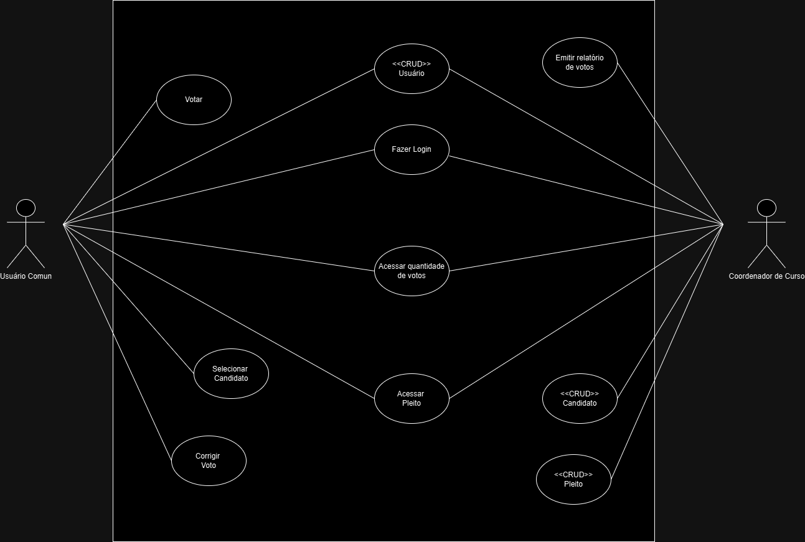

# Especificação do projeto

O presente projeto será desenvolvido utilizando HTML, CSS e JavaScript (JS). O HTML é uma linguagem de marcação utilizada na construção de páginas na Web que podem ser interpretados por navegadores. Com o desenvolvimento dos navegadores e a popularização da internet, o HTML está sendo utilizado em conjunto com outras ferramentas, como o CSS e o JavaScript, que também serão utilizados nesse trabalho, para agregar o desenvolvimento web de forma dinâmica.
CSS é chamado de linguagem Cascading Style Sheet e é usado para estilizar elementos escritos em uma linguagem de marcação como HTML. O CSS separa o conteúdo da representação visual do site.
JavaScript é uma linguagem de programação interpretada estruturada, de script em alto nível com tipagem dinâmica fraca e multiparadigma. Juntamente com HTML e CSS, o JavaScript é uma das três principais tecnologias da World Wide Web.
O backend poderá ser desenvolvido com a linguagem a escolha do grupo, para que seja contemplada a persistência de dados, via BD e/ou APIs.
Com isso, o projeto irá contemplar as funcionalidades abaixo descritas, mediante as necessidades verificadas junto ao público alvo definido.

## Personas

1. _Mariana Alves tem 22 anos, está no 7º período de Engenharia de Produção na PUC Minas. Ela é uma estudante aplicada, que divide seu tempo entre as aulas, um estágio em uma grande empresa de engenharia e atividades extracurriculares. Mariana deseja participar das eleições de líderes de turma, mas precisa de uma solução digital rápida e prática, pois sua rotina é muito corrida e ela não tem tempo para votações presenciais. Ela busca um sistema de votação online que lhe permita votar de forma rápida, sem atrapalhar suas responsabilidades acadêmicas e profissionais._

2. _Lucas Pereira tem 19 anos, está cursando o 3º período de Comunicação Social na PUC Minas. Lucas é ativo nas redes sociais e gosta de participar das atividades da faculdade, como campanhas e eleições de representantes de turma. Ele valoriza a flexibilidade e a conveniência, pois sua rotina é bastante dinâmica. Lucas deseja votar de qualquer lugar e a qualquer hora, sem precisar estar presente fisicamente no campus. Ele está procurando uma plataforma digital que o permita participar mais ativamente das decisões acadêmicas, oferecendo uma experiência fácil e acessível pelo celular._

3. _Beatriz Santos tem 18 anos e acaba de começar seu curso de Direito na PUC Minas. Como uma aluna recém-ingressa, Beatriz ainda está se familiarizando com a dinâmica e os processos da universidade. Ela está entusiasmada para se envolver nas atividades acadêmicas, mas sente insegurança em relação a alguns procedimentos, como a votação de representantes estudantis. Beatriz deseja um sistema intuitivo e confiável para se cadastrar e votar, usando suas credenciais universitárias, de modo a se sentir segura e integrada ao ambiente acadêmico._

4. _Carlos Mendes tem 24 anos e é membro do Diretório Acadêmico de Engenharia da PUC Minas. Carlos é responsável por monitorar e organizar eleições estudantis dentro da faculdade. Ele precisa de uma forma de acompanhar o andamento das votações e garantir que todo o processo ocorra sem problemas. Carlos busca um sistema de votação digital que facilite o monitoramento da participação dos alunos e a identificação de quaisquer dificuldades ou anomalias no processo, garantindo que as eleições sejam justas e transparentes._

5. _Ana Costa tem 45 anos e é coordenadora do curso de Administração na PUC Minas. Ana é responsável por garantir que os processos eleitorais para representantes de turma ocorram de forma justa e sem fraudes. Ela precisa de um sistema de votação que assegure a integridade dos resultados, refletindo a escolha real dos alunos. Ana está em busca de uma plataforma digital que permita não apenas monitorar o progresso das votações em tempo real, mas também adicionar ou remover candidatos conforme necessário, mantendo o processo sempre justo e transparente._

6. _Roberto Lima tem 47 anos e é coordenador de curso e membro do Diretório Acadêmico da PUC Minas. Roberto é comprometido com a participação estudantil e acredita que uma maior acessibilidade ao processo eleitoral é fundamental para o engajamento dos alunos. Ele quer um sistema que permita cadastrar candidatos facilmente e que incentive o maior número possível de alunos a participar das eleições de líderes e representantes de turma. Roberto busca uma solução digital que simplifique o processo de candidatura e votação, tornando-o mais acessível para todos os alunos._

## Histórias de usuários

Com base na análise das personas, foram identificadas as seguintes histórias de usuários:

| EU COMO... `PERSONA`          | QUERO/PRECISO ... `FUNCIONALIDADE`                                                                                                                                           | PARA ... `MOTIVO/VALOR`                                                                                                        |
| ----------------------------- | ---------------------------------------------------------------------------------------------------------------------------------------------------------------------------- | ------------------------------------------------------------------------------------------------------------------------------ |
| Aluno                         | um meio de votação digital fácil e rápido                                                                                                                                    | para participar das eleições de lidar de turma sem despender de muito tempo                                                    |
| Aluno                         | votar nas eleições e campanhas da faculdade em qualquer lugar e a qualquer hora                                                                                              | para que eu tenha mais flexibilidade de participar das eleições aumentando minha participação e conveniência na vida acadêmica |
| Aluno                         | me cadastrar no sistema de votação usando minhas credenciais                                                                                                                 | para votar com facilidade e confiança mesmo sendo novo na instituição                                                          |
| Aluno                         | isualizar a lista de candidatos do meu curso e período                                                                                                                       | para que possa fazer a melhor escolha durante a votação                                                                        |
| Aluno                         | escolher o candidato e confirmar meu voto tendo garantia que foi efetuado                                                                                                    | para que eu tenha a garantia que minha escolha foi registrada corretamente                                                     |
| Membro do diretório acadêmico | um sistema para acompanhar o andamento das eleições de forma mais fácil                                                                                                      | para monitorar a participação dos alunos e identificar qualquer dificuldade ou anomalia no processo                            |
| Membro do diretório acadêmico | poder visualizar a lista completa de candidatos antes do inicio das votações                                                                                                 | para garantir que todos foram cadastrados corretamente e sem nenhuma redundância                                               |
| Coordenador de curso          | um sistema em que possam ser cadastrados candidatos para que se elejam lideres e representantes de turma                                                                     | para que seja possível facilitar a participação do maior número possível de alunos nesse processo                              |
| Coordenador de curso          | um sistema que garanta que os resultados estão refletindo a escolha real dos alunosAlterar permissões                                                                        | para garantir que as votações sejam justas e sem qualquer tipo de fraude                                                       |
| Coordenador de curso          | um sistema que garanta que os resultados estão refletindo a escolha real dos alunosAlterar permissõester a capacidade de adicionar ou remover candidatos da lista de votação | para manter a lista sempre atualizada e precisa                                                                                |
| Coordenador de curso          | monitorar o progresso das votações em tempo real                                                                                                                             | para verificar o andamento do processo e garantir transparência                                                                |
| Coordenador de curso          | gerar relatórios com os resultados das votações com os votos para cada candidato                                                                                             | para analisar os resultados e garantir transparência no processo                                                               |

## Requisitos

As tabelas a seguir apresentam os requisitos funcionais e não funcionais que detalham o escopo do projeto. Para determinar a prioridade dos requisitos, aplique uma técnica de priorização e detalhe como essa técnica foi aplicada.

### Requisitos funcionais

| ID     | Descrição do Requisito                                                                               | Prioridade |
| ------ | ---------------------------------------------------------------------------------------------------- | ---------- |
| RF-001 | deve possuir uma página inicial                                                                      | MÉDIA      |
| RF-002 | Deve possuir uma página de login                                                                     | ALTA       |
| RF-003 | Deve possuir uma página de cadastro de usuario                                                       | ALTA       |
| RF-004 | Deve possuir uma pagina para cadastro de votação                                                     | ALTA       |
| RF-005 | Deve possuir uma menssagem de confirmação na tela de votação                                         | MÉDIA      |
| RF-006 | Deve permiter correção de voto                                                                       | MÉDIA      |
| RF-007 | Deve ter um comprovante de voto                                                                      | BAIXA      |
| RF-008 | Deve contabilizar os votos de cada candidato                                                         | ALTA       |
| RF-009 | Deve emitir ao final de cada eleição o vencendor com a quantidade de votos                           | ALTA       |
| RF-010 | Deve possuir uma tela com informações da quantidade de votos                                         | MÉDIA      |
| RF-011 | Deve possuir uma tela com informações de todos os candidatos disponiveis para a votação              | MÉDIA      |
| RF-012 | O sistema deve poder selecionar um candidato                                                         | ALTA       |
| RF-013 | O sistema deve impedir mais de um voto durante a mesma votação                                       | MÉDIA      |
| RF-014 | O sistema deve permitir exclusão ou adição de candidaturas antes de se iniciar o processo de votação | ALTA       |
| RF-015 | O sitema deve atualizar em tempo real a lista de cadidatos                                           | MÉDIA      |

### Requisitos não funcionais

| ID      | Descrição do Requisito                                                                                        | Prioridade |
| ------- | ------------------------------------------------------------------------------------------------------------- | ---------- |
| RNF-001 | Deve ser de fácil utilização                                                                                  | MÉDIA      |
| RNF-002 | Deve ter acessibilidade                                                                                       | BAIXA      |
| RNF-003 | Deve ser segura                                                                                               | ALTA       |
| RNF-004 | Deve ter controles de acesso para permitir que apenas usuários autorizados possam acessar funções específicas | MÉDIA      |
| RNF-005 | Deve estar disponível 24/7 durante o período de votação                                                       | ALTA       |
| RNF-006 | Os registros dos votos devem ser persistentes                                                                 | ALTA       |
| RNF-007 | O tempo de resposta para as ações dos usuários não deve passar de 3s                                          | BAIXA      |
| RNF-008 | O sistema deve ter robustez                                                                                   | BAIXA      |
| RNF-009 | O sistema deve ser seguro e transparente                                                                      | ALTA       |
| RNF-010 | O sistema deve ser responsivo                                                                                 | BAIXA      |

## Restrições

Enumere as restrições à sua solução. Lembre-se de que as restrições geralmente limitam a solução candidata.

O projeto está restrito aos itens apresentados na tabela a seguir.

| ID  | Restrição                                                                                                |
| --- | -------------------------------------------------------------------------------------------------------- |
| 001 | O projeto deverá ser entregue até o final do semestre                                                    |
| 002 | A equipe não pode subcontratar o desenvolvimento do trabalho.                                            |
| 003 | O sistema deve ser compatível com a infraestrutura de tecnologia existente na universidade               |
| 004 | O sistema deve ser acessível a todos os alunos, incluindo aqueles com deficiências físicas ou sensoriais |

## Diagrama de casos de uso

