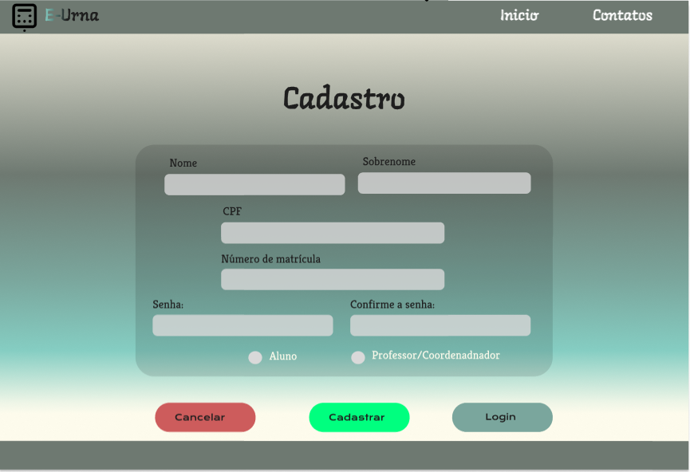

# Projeto de interface

## Wireframes
**Tela de inicio:**

**Tela Login Usuário:**

**Tela Cadastro de Usuário:**

**Tela de Perfil Estudante:**

**Tela de Votação:**

**Tela Perfil Coordenador/Administrador:**

**Tela Cadastro e Edição de Pleito (votação):**

**Tela Cadastro e Edição de candidato:**

**Tela de Acompanhamento da(s) Votação(ões):**

## User flow

### Diagrama de fluxo

O diagrama apresenta o estudo do fluxo de interação do usuário com o sistema interativo, muitas vezes sem a necessidade de desenhar o design das telas da interface. Isso permite que o design das interações seja bem planejado e tenha impacto na qualidade do design do wireframe interativo que será desenvolvido logo em seguida.

O diagrama de fluxo pode ser desenvolvido com “boxes” que possuem, internamente, a indicação dos principais elementos de interface — tais como menus e acessos — e funcionalidades, como editar, pesquisar, filtrar e configurar, além da conexão entre esses boxes a partir do processo de interação.

> **Links úteis**:
>
> - [Como criar um diagrama de fluxo de usuário](https://www.lucidchart.com/blog/how-to-make-a-user-flow-diagram)
> - [Fluxograma online: seis sites para fazer gráfico sem instalar nada](https://www.techtudo.com.br/listas/2019/03/fluxograma-online-seis-sites-para-fazer-grafico-sem-instalar-nada.ghtml)

## Interface do sistema

Visão geral da interação do usuário por meio das telas do sistema.

> Apresente as principais interfaces da plataforma em sua versão final.
