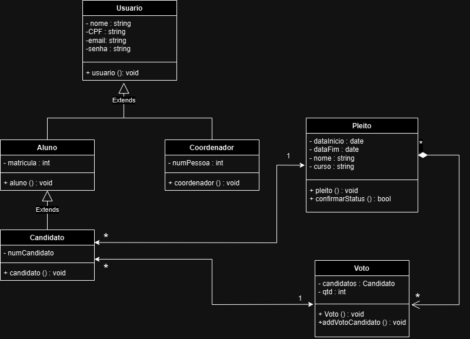
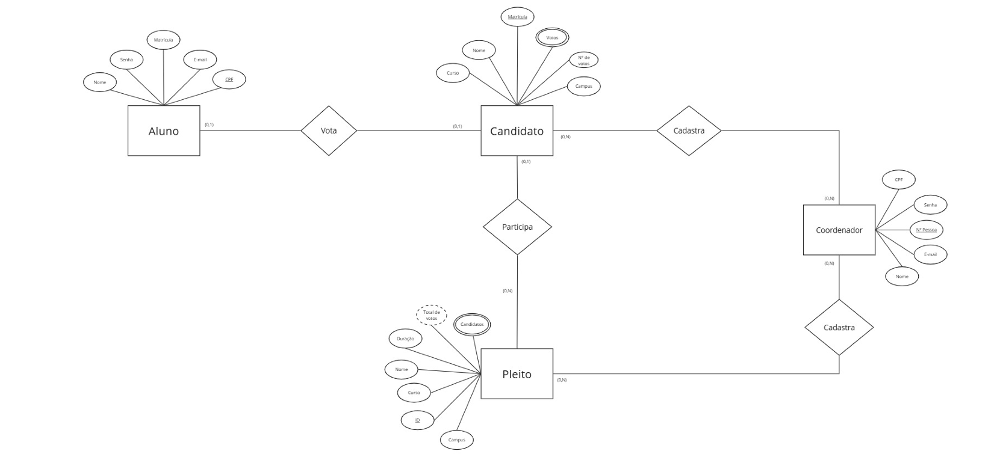
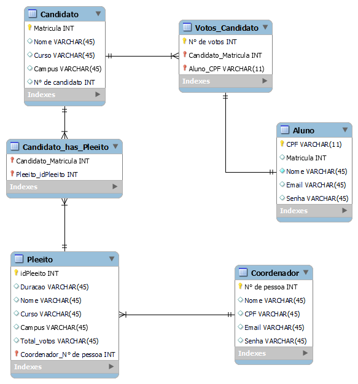

# Arquitetura da solução

<span style="color:red">Pré-requisitos: <a href="04-Projeto-interface.md"> Projeto de interface</a></span>

Definição de como o software é estruturado em termos dos componentes que fazem parte da solução e do ambiente de hospedagem da aplicação.


## Diagrama de classes



##  Modelo de dados

>**Modelo Entidade Relacionamento**




### Modelo ER

 




### Modelo físico


```sql
CREATE TABLE Usuario (
    id BIGINT AUTO_INCREMENT PRIMARY KEY,
    nome VARCHAR(255) NOT NULL,
    num_matricula BIGINT UNIQUE NOT NULL,
    email VARCHAR(255),
    senha VARCHAR(255) NOT NULL,
    curso VARCHAR(255)
);

CREATE TABLE Pleito (
    id BIGINT AUTO_INCREMENT PRIMARY KEY,
    nome_pleito VARCHAR(100) NOT NULL,
    status ENUM('ATIVO', 'ENCERRADO') NOT NULL,
    data_inicio DATE,
    data_termino DATE,
    votos_totais INT NOT NULL
);


CREATE TABLE Candidato (
    id BIGINT AUTO_INCREMENT PRIMARY KEY,
    nome VARCHAR(100) NOT NULL,
    curso VARCHAR(100),
    numero_candidato BIGINT NOT NULL UNIQUE,
    pleito_id BIGINT NOT NULL,
    FOREIGN KEY (pleito_id) REFERENCES Pleito(id) ON DELETE CASCADE
);


CREATE TABLE Voto (
    id BIGINT AUTO_INCREMENT PRIMARY KEY,
    numero_votos INT,
    data_registro DATE,
    numero_candidato BIGINT NOT NULL,
    usuario_id BIGINT NOT NULL,
    pleito_id BIGINT NOT NULL,
    FOREIGN KEY (pleito_id) REFERENCES Pleito(id) ON DELETE CASCADE,
    FOREIGN KEY (numero_candidato) REFERENCES Candidato(id) ON DELETE CASCADE,
    FOREIGN KEY (usuario_id) REFERENCES Usuario(id) ON DELETE CASCADE
);
```


## Tecnologias

**Mobile App (Frontend):**
- React Native: Framework para desenvolvimento de aplicativos móveis multiplataforma.
- TypeScript: Linguagem de programação que adiciona tipagem estática ao JavaScript.
  
**Backend API:**
- Spring Boot: Framework para criação de aplicações Java com configuração mínima.
- Java + Jakarta EE: Plataforma para desenvolvimento de aplicações empresariais.
  
**Business Logic:**
- Java + Lombok: facilita a criação de código repetitivo, especialmente em classes JavaBeans.
  
**Data Access Layer:**
- JPA/Hibernate: Frameworks para mapeamento objeto-relacional (ORM).
  
**Database:**
- MySQL WorkBench: Sistema de gerenciamento de banco de dados
  
**Documentação:**
- Swagger: Ferramenta para documentação e teste de APIs.


| **Dimensão**   | **Tecnologia**  |
| ---            | ---             |
| Front-end      | TypeScript + React Native |
| Back-end       | Spring Boot + Java + Jakarta EE + Lombok  |
| SGBD           | MySQL           |
| Documentação   | Swagger
| Deploy         | Vercel          |


## Hospedagem

Explique como a hospedagem e o lançamento da plataforma foram realizados.

> **Links úteis**:
> - [Website com GitHub Pages](https://pages.github.com/)
> - [Programação colaborativa com Repl.it](https://repl.it/)
> - [Getting started with Heroku](https://devcenter.heroku.com/start)
> - [Publicando seu site no Heroku](http://pythonclub.com.br/publicando-seu-hello-world-no-heroku.html)

## Qualidade de software

Conceituar qualidade é uma tarefa complexa, mas ela pode ser vista como um método gerencial que, por meio de procedimentos disseminados por toda a organização, busca garantir um produto final que satisfaça às expectativas dos stakeholders.

No contexto do desenvolvimento de software, qualidade pode ser entendida como um conjunto de características a serem atendidas, de modo que o produto de software atenda às necessidades de seus usuários. Entretanto, esse nível de satisfação nem sempre é alcançado de forma espontânea, devendo ser continuamente construído. Assim, a qualidade do produto depende fortemente do seu respectivo processo de desenvolvimento.

A norma internacional ISO/IEC 25010, que é uma atualização da ISO/IEC 9126, define oito características e 30 subcaracterísticas de qualidade para produtos de software. Com base nessas características e nas respectivas subcaracterísticas, identifique as subcaracterísticas que sua equipe utilizará como base para nortear o desenvolvimento do projeto de software, considerando alguns aspectos simples de qualidade. Justifique as subcaracterísticas escolhidas pelo time e elenque as métricas que permitirão à equipe avaliar os objetos de interesse.

> **Links úteis**:
> - [ISO/IEC 25010:2011 - Systems and Software Engineering — Systems and Software Quality Requirements and Evaluation (SQuaRE) — System and Software Quality Models](https://www.iso.org/standard/35733.html/)
> - [Análise sobre a ISO 9126 – NBR 13596](https://www.tiespecialistas.com.br/analise-sobre-iso-9126-nbr-13596/)
> - [Qualidade de software - Engenharia de Software](https://www.devmedia.com.br/qualidade-de-software-engenharia-de-software-29/18209)
